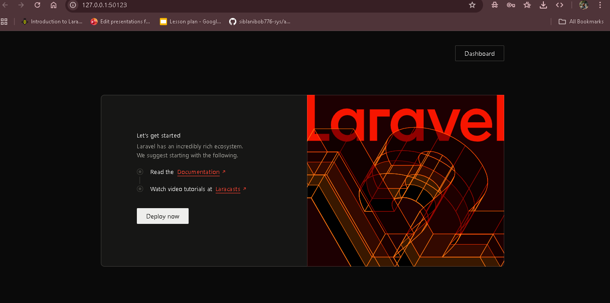
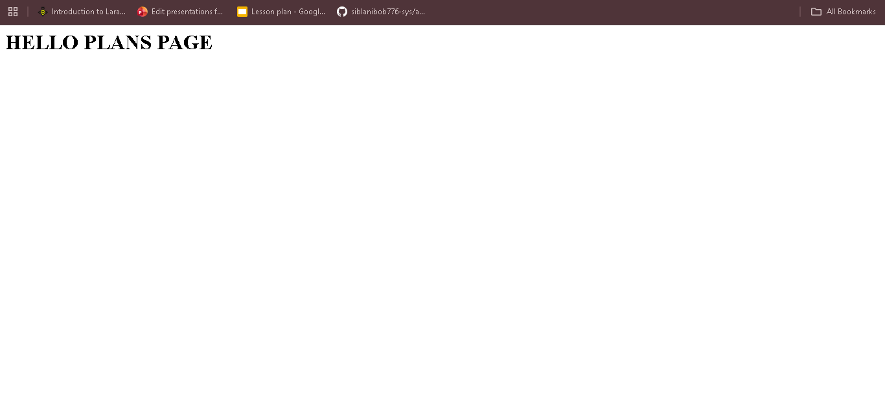

<p align="center">
  <h1 align="center">SaaS Subscription Engine</h1>
  <p align="center">
    Production-style Laravel SaaS starter with subscription-ready architecture.
  </p>
</p>


## Screenshots

### Home


### Dashboard


### Plans



## 🚀 Live Features Demonstrated

- Secure authentication (Laravel Breeze)
- Dynamic pricing plans system
- Subscription-ready architecture
- Stripe-ready billing structure (Laravel Cashier)
- Clean service-based architecture

## 🧠 Architecture Overview

This project follows a scalable SaaS architecture pattern:

- Controllers handle HTTP layer
- Business logic prepared for service layer separation
- Subscription lifecycle designed for Stripe integration
- Environment-based DB configuration (SQLite dev / MySQL prod)


## 🚀 Features

- Laravel Breeze Authentication
- Plans System (Free / Pro / Business)
- Laravel Cashier (Stripe-ready billing structure)
- `/plans` dynamic pricing page
- Subscription lifecycle (Subscribe / Cancel / Resume – WIP)
- Clean, scalable folder architecture

---

## 🧰 Tech Stack

- Laravel 11/12 + PHP 8+
- Blade + Tailwind CSS
- SQLite (development) / MySQL (production-ready)
- Laravel Cashier (Stripe integration structure)

---

## ⚙️ Installation

```bash
git clone <your-repo-url>
cd saas-subscription-engine
composer install
cp .env.example .env
php artisan key:generate
type nul > database/database.sqlite
php artisan migrate:fresh --seed
npm install
npm run build
php -S 127.0.0.1:8000 -t public
